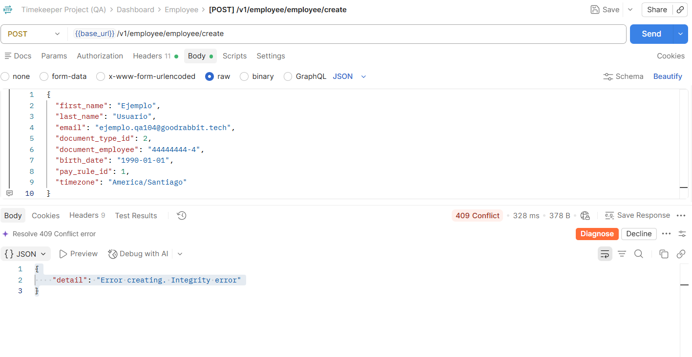
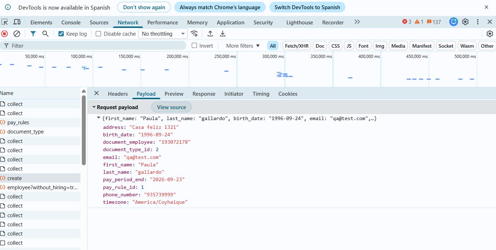
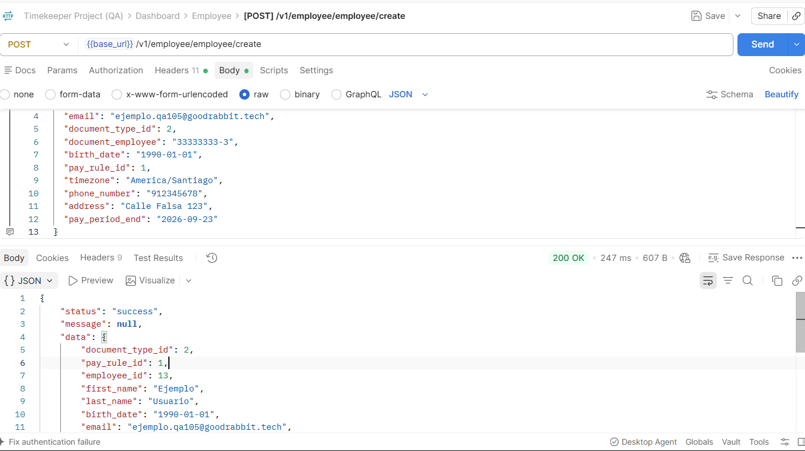

# BUG-001: Validación incompleta en creación de empleados — error 409 engañoso por campos requeridos no declarados

**Severidad:** Alta
**Prioridad:** Alta
**Componente:** API Employee — `POST /v1/employee/employee/create`
**Ambiente:** QA (https://demo.timekeeper.goodrabbit.tech)
**Reportado por:** Paula Gallardo Carrasco
**Fecha:** 24-25 de septiembre de 2026

---

## Resumen

El endpoint `POST /v1/employee/employee/create` exige los campos `phone_number`, `address` y `pay_period_end` para completar la creación de un empleado, pero **no los declara como obligatorios** en su validación de esquema (422). Sin ellos, la petición no falla con un mensaje claro: falla con `409 Conflict` y el mensaje genérico `"Error creating. Integrity error"`, que sugiere un problema de duplicado de datos cuando en realidad se trata de campos faltantes.

La causa se identificó comparando un request fallido (vía Postman) contra uno exitoso capturado desde el Dashboard Web (vía DevTools), que sí incluía esos tres campos adicionales.

## Pasos para reproducir

**Caso que falla (409 engañoso):**
1. Autenticarse en `POST /v1/login`.
2. Enviar `POST /v1/employee/employee/create` con un body válido según lo que el 422 indica como requerido, pero **sin** `phone_number`, `address` ni `pay_period_end`:
   ```json
   {
     "first_name": "Ejemplo",
     "last_name": "Usuario",
     "email": "ejemplo.qa101@goodrabbit.tech",
     "document_type_id": 2,
     "document_employee": "77777777-7",
     "birth_date": "1990-01-01",
     "pay_rule_id": 2,
     "timezone": "America/Santiago"
   }
   ```
3. Resultado: `409 Conflict`, `{ "detail": "Error creating. Integrity error" }`.

**Caso que funciona (con los 3 campos agregados):**
4. Enviar el mismo body, agregando `phone_number`, `address` y `pay_period_end`:
   ```json
   {
     "first_name": "Ejemplo",
     "last_name": "Usuario",
     "email": "ejemplo.qa103@goodrabbit.tech",
     "document_type_id": 2,
     "document_employee": "55555555-5",
     "birth_date": "1990-01-01",
     "pay_rule_id": 1,
     "timezone": "America/Santiago",
     "phone_number": "912345678",
     "address": "Calle Falsa 123",
     "pay_period_end": "2026-09-23"
   }
   ```
5. Resultado: `200 OK` en 679 ms, empleado creado correctamente (`employee_id: 10`).

## Resultado esperado

Una de estas dos opciones (a definir por el equipo, según la regla de negocio real):
- Si `phone_number`, `address` y `pay_period_end` son obligatorios: el endpoint debería rechazar su ausencia con `422` y listarlos explícitamente, igual que hace con `pay_rule_id`, `birth_date`, `document_employee` y `timezone`.
- Si no deberían ser obligatorios: el endpoint debería crear el empleado sin ellos, sin lanzar un error de integridad.

## Resultado actual

`409 Conflict` con un mensaje que no identifica la causa real (sugiere conflicto/duplicado), cuando el problema real es la ausencia de campos no declarados como requeridos por la propia validación del endpoint.

## Cómo se aisló la causa raíz

1. Se probó variando de forma independiente `email`, `document_employee`, `pay_rule_id` (1 y 2) y `document_type_id` (1 y 2): el 409 persistió en todos los casos, descartando un conflicto de unicidad en algún campo puntual (matriz de intentos abajo).
2. Se creó un empleado nuevo exitosamente desde el **Dashboard Web** (UI), y se capturó el request real vía DevTools (Network tab). Ese request incluía tres campos que nunca se habían enviado desde Postman: `phone_number`, `address`, `pay_period_end`.
3. Se replicó el mismo body en Postman agregando esos tres campos: la creación fue exitosa (`200 OK`, `employee_id: 10`).

## Evidencia: matriz de intentos

| # | Vía | Campos distintivos | phone/address/pay_period_end | Resultado |
|---|---|---|---|---|
| 1 | Postman | body original de la colección (incompleto) | No | 422 — faltan pay_rule_id, birth_date, document_employee, timezone |
| 2 | Postman | email/documento únicos, pay_rule_id: 1 | No | 409 |
| 3 | Postman | email/documento únicos, pay_rule_id: 1 | No | 409 |
| 4 | Postman | sin pay_rule_id | No | 422 — pay_rule_id requerido |
| 5 | Postman | pay_rule_id: 2 | No | 409 |
| 6 | Postman | document_type_id: 1 | No | 409 |
| 7 | Dashboard (UI) | flujo normal del formulario | **Sí** | **200 OK** — employee_id: 9 |
| 8 | Postman (confirmación) | mismo body que #5, + los 3 campos | **Sí** | **200 OK** — employee_id: 10, 679 ms |






## Impacto

Cualquier integración, script o cliente de API que arme el body de creación de empleados guiándose únicamente por el error 422 (que solo pide 4 campos) va a chocar con un `409` que no explica el problema real, haciendo muy difícil de depurar sin acceso al código fuente o, como en este caso, sin poder comparar contra un request exitoso del propio Dashboard. Esto también afecta directamente a la propia colección Postman entregada con el reto, cuyo body de ejemplo tampoco incluye estos tres campos.

## Nota adicional (documentación)

El body de ejemplo en la colección Postman entregada con el reto usa `document_number` (el campo real es `document_employee`) y no incluye `pay_rule_id`, `birth_date`, `timezone`, `phone_number`, `address` ni `pay_period_end`.