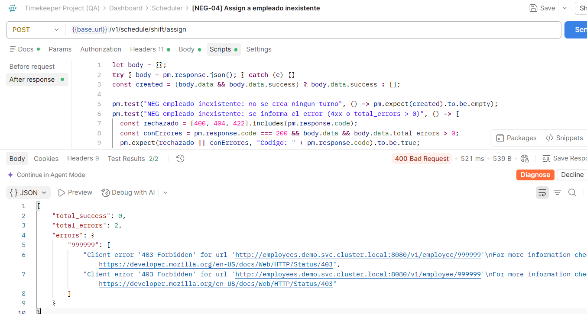

# BUG-003: Fuga de información interna de infraestructura en mensajes de error

**Severidad:** Media (Seguridad)
**Prioridad:** Media
**Componente:** API Scheduler — `POST /v1/schedule/shift/assign` (comunicación interna con el servicio de Employees)
**Ambiente:** QA (https://demo.timekeeper.goodrabbit.tech)
**Reportado por:** Paula Gallardo Carrasco
**Fecha:** 25 de septiembre de 2026

---

## Resumen

Al intentar asignar un turno a un `employee_id` inexistente, el API Gateway devuelve un mensaje de error que **expone la URL interna del microservicio de Empleados** dentro del clúster (probablemente Kubernetes, a juzgar por el patrón de nombre `*.svc.cluster.local`), incluyendo host, puerto y ruta interna. Esta información de arquitectura interna no debería llegar nunca a un cliente externo de la API.

## Pasos para reproducir

1. Autenticarse en `POST /v1/login`.
2. Enviar `POST /v1/schedule/shift/assign` con un `employee_ids` que no exista en el sistema, por ejemplo `[999999]`.
3. Observar el cuerpo de la respuesta de error.

## Resultado esperado

Un mensaje de error genérico y orientado al cliente, por ejemplo: `"El empleado 999999 no existe"` o `"Empleado no encontrado"`, sin exponer nombres de host, puertos ni rutas de servicios internos.

## Resultado actual

`400 Bad Request` con el siguiente cuerpo:
```json
{
    "total_success": 0,
    "total_errors": 2,
    "errors": {
        "999999": [
            "Client error '403 Forbidden' for url 'http://employees.demo.svc.cluster.local:8080/v1/employee/999999'\nFor more information check: https://developer.mozilla.org/en-US/docs/Web/HTTP/Status/403",
            "Client error '403 Forbidden' for url 'http://employees.demo.svc.cluster.local:8080/v1/employee/999999'\nFor more information check: https://developer.mozilla.org/en-US/docs/Web/HTTP/Status/403"
        ]
    }
}
```

## Análisis

1. **Fuga de infraestructura:** la URL `http://employees.demo.svc.cluster.local:8080/...` revela la convención de nombres de servicios internos, el puerto del microservicio de Empleados y que la arquitectura usa Kubernetes (o similar) con Service Discovery vía DNS interno (`.svc.cluster.local`). Esto facilita a un atacante mapear la infraestructura interna en caso de que logre explotar otra vulnerabilidad (por ejemplo, SSRF).
2. **Código de error inconsistente:** el servicio interno de Employees responde `403 Forbidden` al Scheduler al consultar un empleado inexistente, cuando lo semánticamente correcto sería `404 Not Found`. Esto sugiere que el Scheduler no tiene los permisos correctos para consultar al servicio de Employees (un problema de configuración entre servicios), y ese fallo de autorización es el que termina bloqueando, por una vía indirecta, la creación del turno.
3. **Mensaje duplicado:** el error aparece 2 veces idéntico en el arreglo, probablemente por un reintento interno fallido, lo que también sería útil investigar (doble llamada innecesaria al servicio de Employees).

## Impacto

Riesgo de seguridad de severidad media: no permite explotación directa, pero entrega información de reconocimiento (nombres de host, puertos, topología de servicios) que normalmente se considera mala práctica exponer en respuestas de API públicas o semi-públicas. Además, señala un problema de configuración de permisos entre microservicios internos (Scheduler → Employees) que podría estar afectando otros flujos no probados en este challenge.

## Evidencia

Respuesta completa de la API adjunta arriba (ver también `evidencias/bug-003/`).
